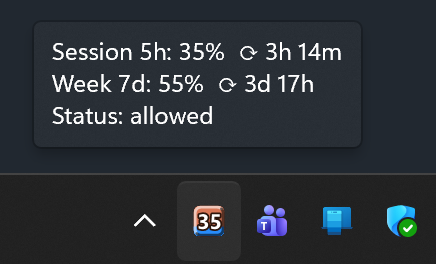
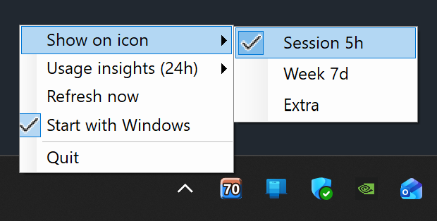
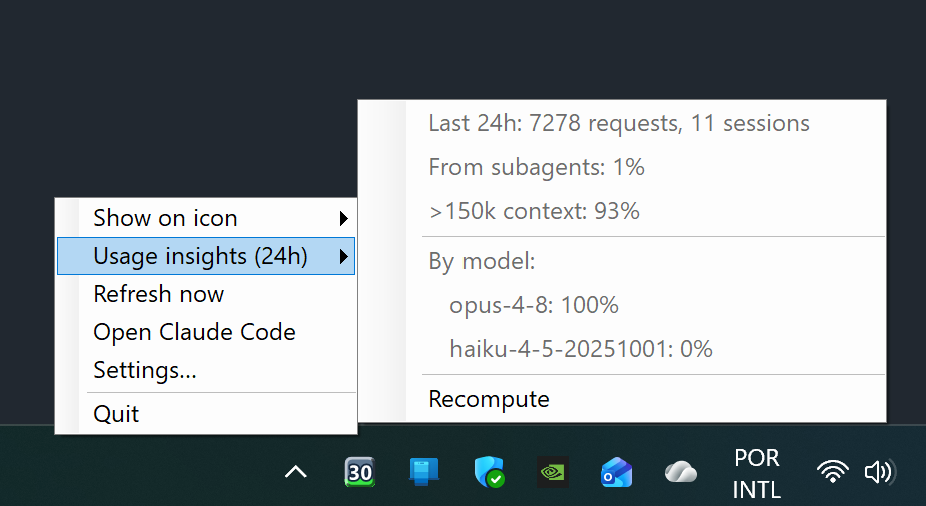

<div align="center">


# Claude Code Tray

**A native Windows tray monitor for your Claude Code usage — at a glance, always on.**

A WinForms (`NotifyIcon` + GDI+) rewrite that lives **only in the Windows tray** and
shows your **rate-limit usage percentage** as a crisp, DPI-aware icon.



&nbsp;&nbsp;


</div>

---

> **Unofficial / community project.** Not affiliated with, endorsed by, or sponsored by
> Anthropic. "Claude" and "Claude Code" are trademarks of Anthropic; this tool merely reads
> the usage data Claude Code already exposes on your own machine.

Why .NET instead of Python: the number is drawn as a **vector** (`GraphicsPath`,
with an outline), **at the actual size** the tray requests (`SM_CXSMICON`) and with
**DPI awareness** (`PerMonitorV2`). No downscaling a 64px bitmap — the number stays
crisp, especially on 125–200% displays (20–32px icons).

## Look

- Background: Claude clay/coral `#D97757`
- **Vertical fill bar** (Task Manager style) rises from the bottom up, proportional to usage
  (50% = bottom half; 100% = whole tile). **Blue** normally; turns **vivid red** when the
  projection says usage will hit 100% **before** the window resets (see below)
- **3D bevel border**: light highlight on the top/left and shadow on the bottom/right → relief
- Number: large digits, white with a **dark outline** (readable at any size)
- ≥90%: the background flashes
- Amber = API error · while connecting (before the first reading) it shows the **app logo**

The **app icon** (`.exe`, installer, shortcuts) is the same clay tile with a white spark mark —
generated as a multi-resolution `.ico` from the same GDI+ renderer (`ClaudeTray.ico`).

Tooltip (hover): 5h session, 7d week, extra usage, countdown to reset, the **projected
time to 100%** (labelled with the active window, e.g. *Week 7d projection*), and status.

## Projection (observability)

Beyond the current percentage, the app projects when usage would reach 100% and warns you
*before* the window resets. Two verdicts drive the fill-bar color:

- **on track** — usage stays under 100% until the window resets → the fill bar stays its
  normal blue (no extra signal)
- **danger** — usage hits 100% *before* the reset (you'll run out early) → the fill bar turns
  **vivid red**

How the verdict is computed depends on the window:

- **Week 7d — pace line.** The weekly window uses a proportional rule: it compares your
  current usage against the share an even, constant burn would have spent by now
  (`elapsed ÷ 7 days`). If you're above that line, it's *danger*. The projected time to 100%
  is a rule-of-three from your average pace since the window started
  (`elapsed × (100 − used) ÷ used`). This needs no history — it's accurate from the first
  reading — and a short burst over a 7-day window won't trip a false alarm the way a slope
  fit would.
- **Session 5h / Extra — burn rate.** These keep a short rolling history of utilization
  samples, estimate the slope by least-squares regression, and project exhaustion from the
  current pace. They kick in after a couple of polls (~5–10 min), once there is enough
  history to trust the trend.

The bar color and the tooltip's projected time follow whichever metric you have **Show on
icon** set to (session 5h, week 7d, or extra). Resets are detected and clear the history.

## Usage insights (last 24h)

<div align="center">

</div>

The right-click menu has a **Usage insights (24h)** submenu computed locally from your
Claude Code session transcripts (`~/.claude/projects/**/*.jsonl`) — no API call. Tokens are
weighted by per-model price (Opus/Sonnet/Haiku/Fable) so each percentage reflects share of
*usage*, not just request count:

- **Last 24h** — request and session counts
- **From subagents** — share of usage from subagent (sidechain) requests
- **>150k context** — share of usage from requests with a large prompt context
- **By model** — top models by share of usage

Only token counts, model ids, and flags are read — never message content. The scan is
bounded to files touched in the last 24h and runs in the background (refreshed on each poll).

## Data source

A minimal call to the Anthropic API (Haiku, 1 token) every 5 min reads the
`anthropic-ratelimit-unified-*` headers, using the OAuth token Claude Code keeps in
`~/.claude/.credentials.json`. No extra configuration. The usage-insights submenu instead
reads the local session transcripts (see above).

## Credentials (setup)

There is **nothing to configure manually** — the app reuses Claude Code's own credentials.
On each poll it reads the OAuth token from:

```
%USERPROFILE%\.claude\.credentials.json
```

looking up the `claudeAiOauth.accessToken` field. That file is created and refreshed
automatically by Claude Code when you log in. There is no API key to paste and no
environment variable to set.

1. **Install Claude Code** (if you don't have it yet).
2. **Log in at least once** by running `claude` in a terminal — this writes
   `~/.claude/.credentials.json` with the OAuth token.
3. **Run the tray app** — it finds the file on its own (see
   [Build and run](#build-and-run)).

If you want to confirm the token exists, check that
`%USERPROFILE%\.claude\.credentials.json` contains `claudeAiOauth.accessToken`. When the
token expires the icon turns amber and the tooltip reads **not authenticated** — right-click →
**Open Claude Code** (or run `claude` yourself) to refresh it, then **Refresh now** (see
[Troubleshooting](#troubleshooting)).

## ⚠️ Authentication & Anthropic's terms — please read

This tool reuses your **subscription** OAuth token (`claudeAiOauth.accessToken`) to make a
minimal, automated call to the Anthropic Messages API on each poll, purely to read the
`anthropic-ratelimit-unified-*` headers. You should understand how that sits with Anthropic's
current terms before relying on it.

Anthropic's [Claude Code legal & compliance docs](https://code.claude.com/docs/en/legal-and-compliance)
state (verbatim):

> **OAuth authentication** is intended exclusively for purchasers of Claude Free, Pro, Max,
> Team, and Enterprise subscription plans and is designed to support **ordinary use of Claude
> Code and other native Anthropic applications**.
>
> **Developers** building products or services that interact with Claude's capabilities …
> **should use API key authentication** through Claude Console or a supported cloud provider.
> Anthropic does not permit third-party developers to **offer Claude.ai login** or to **route
> requests through Free, Pro, or Max plan credentials on behalf of their users**.
>
> Anthropic reserves the right to take measures to enforce these restrictions and **may do so
> without prior notice**.

What this means for this tool:

- **It is *not* the explicitly prohibited case.** It does not offer Claude.ai login to anyone
  and does not route requests *on behalf of other users* — it runs locally, single-user, with
  **your own** credentials, for **your own** individual use.
- **It *is* a gray area.** A self-directed, automated API call from a non-native app arguably
  falls outside "ordinary use of Claude Code." Use it at your own discretion and risk.
- **`claude setup-token` is *not* a fix.** That token is *scoped to inference only*, is reported
  to be **rejected by the Messages API** (so it likely wouldn't work here), and is still a
  subscription credential under the same Consumer Terms — it changes nothing legally.
- **There is no fully "clean" alternative that keeps this feature.** The unified subscription
  rate-limit headers only exist on subscription OAuth credentials; an API key (the path
  Anthropic points developers to) would report *API* limits, not your subscription's.
- **To minimize exposure**, keep the refresh interval conservative (Settings → refresh interval)
  — every poll is one automated API call.

Governing terms: [Consumer Terms](https://www.anthropic.com/legal/consumer-terms) (Free/Pro/Max),
[Commercial Terms](https://www.anthropic.com/legal/commercial-terms) (Team/Enterprise/API),
[Usage Policy](https://www.anthropic.com/legal/aup).

## Requirements

- Windows 10/11
- .NET 10 SDK (to build) — the self-contained `.exe` does not require .NET to be installed to run
- Claude Code installed and logged in (run `claude` at least once)

## Build and run

```
dotnet run -c Release            # build and run
```

### Produce a single .exe (self-contained, no dependencies)

```
dotnet publish -c Release
```

The executable is emitted at `bin\Release\net10.0-windows\win-x64\publish\ClaudeTray.exe`.
It can be copied anywhere and runs without .NET installed.

### Start with Windows

Three ways, from simplest to most complete:

1. **From Settings** (recommended): right-click the icon → **Settings…** → **Startup** →
   **Start with Windows**. Writes/removes a key under `HKCU\…\Run` pointing to the current `.exe`. No admin.
2. **Installer** (see below): check "Start with Windows" during installation.
3. **Manual**: `Win + R` → `shell:startup` → create a shortcut to `ClaudeTray.exe`.

### Build the installer (Inno Setup)

Requires [Inno Setup 6](https://jrsoftware.org/isdl.php).

```
dotnet publish -c Release
"C:\Program Files (x86)\Inno Setup 6\ISCC.exe" installer.iss
```

Produces `dist\ClaudeTray-Setup.exe` — a per-user install (no admin) at
`%LocalAppData%\ClaudeTray`, with a Start Menu shortcut, an autostart option and an
uninstaller. The script is [installer.iss](installer.iss).

### Releasing a new version

The version lives in **one place**: `<Version>` in [ClaudeTray.csproj](ClaudeTray.csproj).
Everything else derives from it — `installer.iss` reads it from the built `.exe`. To cut a
release:

```
# 1) bump <Version> in ClaudeTray.csproj, then:
build-installer.cmd                       # publish + build dist\ClaudeTray-Setup.exe
```

Then create a GitHub release tagged `vX.Y.Z` and attach `ClaudeTray-Setup.exe`. Existing
installs pick it up automatically (see [Updates](#updates)).

## Menu (right-click the icon)

- **Show on icon** — Session 5h / Week 7d / Extra (remembered across restarts)
- **Usage insights (24h)** — local cost breakdown from session transcripts (see below)
- **Refresh now** — immediate API read
- **Open Claude Code** — launches the Claude Code CLI so it re-authenticates and refreshes the
  OAuth token; the recovery path when the icon shows a *not authenticated* (HTTP 401) state
- **Update to vX.Y.Z** — appears only when a newer GitHub release exists; click to download and
  install it (see below)
- **Settings…** — refresh interval, display options, and **Start with Windows** (autostart)
- **Quit**

## Updates

The app checks GitHub Releases on launch and every 6 hours. When a newer release is published,
it shows a notification balloon and an **Update to vX.Y.Z** menu item. Clicking either downloads
`ClaudeTray-Setup.exe` from that release to `%TEMP%` and runs it silently; the app closes so its
`.exe` can be replaced, the installer upgrades in place (same `AppId`), and relaunches it. No
admin rights are needed — it's a per-user install.

Publishing a new version is just: bump `<Version>` in `ClaudeTray.csproj` (and `installer.iss`),
build the installer, and attach `ClaudeTray-Setup.exe` to a GitHub release tagged `vX.Y.Z`.

## Structure

| File | Responsibility |
|---|---|
| `Program.cs` | entry point, `ApplicationContext`, tray icon, menu, poll/flash timers |
| `ApiClient.cs` | reads credentials, calls the API, parses the rate-limit headers |
| `BurnTracker.cs` | tracks utilization history, estimates the burn rate, projects exhaustion |
| `UsageInsights.cs` | aggregates the last 24h of session transcripts into a cost-weighted breakdown |
| `IconRenderer.cs` | draws the icon with GDI+ (vector + outline + projection dot) at the actual size |
| `Updater.cs` | checks GitHub Releases and downloads/runs the installer for in-app self-update |

> Dev tips: `dotnet run -- --render <dir>` dumps sample PNGs at 16/20/32 px for visual
> inspection; `dotnet run -- --insights` prints the 24h usage breakdown to the console;
> `dotnet run -- --makeicon ClaudeTray.ico` regenerates the app icon (multi-resolution `.ico`).

## Troubleshooting

- **Logo icon (spark)** → still connecting; wait for the first call.
- **"session expired" tooltip** → the access token expired but a refresh token is on disk, so no
  login is needed. Right-click → **Open Claude Code**; launching it silently refreshes the token.
  Then **Refresh now**. Common on the first poll after a reboot.
- **"not signed in" tooltip** → there's no refresh token (or no credentials file at all), so a full
  login is required. Right-click → **Open Claude Code**, type `/login`, then **Refresh now**.
- **Amber icon / "API error" tooltip** → a network/API problem. Check connectivity and retry.
- **Only one icon even if launched twice** → by design: a named mutex enforces a single
  instance, so re-running the `.exe` while it's already in the tray just exits silently.

## License

[Apache License 2.0](LICENSE) © 2026 Alexandre Oliveira. Unofficial, community-built — not
affiliated with Anthropic.
